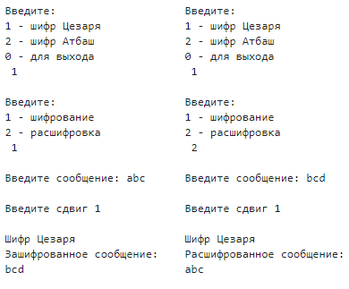
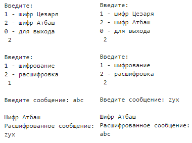

---
## Front matter
lang: ru-RU
title: Лабораторная работа №1
subtitle: Шифры простой замены
author:
  - Баулин Егор Александрович, НФИмд-02-22
institute:
  - Российский университет дружбы народов, Москва, Россия
date: 17 сентября 2022

## i18n babel
babel-lang: russian
babel-otherlangs: english

## Formatting pdf
toc: false
toc-title: Содержание
slide_level: 2
aspectratio: 169
section-titles: true
theme: metropolis
header-includes:
 - \metroset{progressbar=frametitle,sectionpage=progressbar,numbering=fraction}
 - '\makeatletter'
 - '\beamer@ignorenonframefalse'
 - '\makeatother'
---

# Цели и задачи

## Цель лабораторной работы

Знакомство с шифрами простой замены: Цезаря и Атбаш.

## Задачи лабораторной работы 

1. Релизовать шифр Цезаря с произвольным ключом `k`.
2. Реализовать шифр Атбаш.

# Выполнение лабораторной работы

## Шифры простой замены

Шифры простой замены --- это наиболее часто используемые шифры. Они характеризуются тем, что какие-либо отдельные символы исходного текста заменяются другими символами.

## Шифр Цезаря

Математически процедуру шифрования можно описать следующим образом: 

$$ T_m = {~T^j~}, j=0,1, ... , m-1, $$
$$ T^j (a)=(a+j)~mod~m, $$

где $(a+j)~mod~m$ --- операция нахождения остатка от целочисленного деления $a+j$ на $m; T_m$ --- циклическая подгруппа. Пронумеруем буквы латинского алфавита от 0 до 25: $a=0, b=1, c=3, ... , z=25$. В латинском алфавите 26 букв и поэтому примем $m=26$. Тогда операцию шифрования запишем в виде: буква с номером $i$ заменяется на букву с номером $(i+3)~mod~26$. Возможно и обобщение шифра Цезаря на случай произвольного ключа $k$: символ с номером $i$ заменится на символ с номером $(i+k)~mod~26$.

## Шифр Атбаш

Атбаш — простой шифр подстановки для алфавитного письма. Правило шифрования состоит в замене $i$-й буквы алфавита буквой с номером $n-i+1$, где $n$ — число букв в алфавите.
Данный шифр является шифром сдвига на всю длину алфавита.

# Полученные результаты

## Шифр Цезаря

{ #fig:001 width=70% }

## Шифр Атбаш

{ #fig:002 width=70% }

# Выводы

## Результаты выполнения лабораторной работы

Таким образом в процессе лабораторной работы была изучена теоретическая основа шифров простой замены, а также программно реализован шифр Цезаря с с произвольным ключом `k` и шифр Атбаш.

