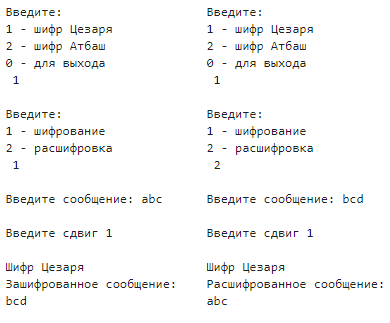
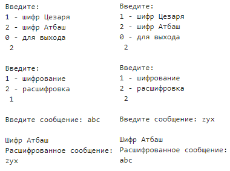

---
## Front matter
title: "Лабораторная работа №1"
subtitle: "Шифры простой замены"
author: "Баулин Егор Александрович, НФИмд-02-22"

## Generic otions
lang: ru-RU
toc-title: "Содержание"

## Bibliography
bibliography: bib/cite.bib
csl: pandoc/csl/gost-r-7-0-5-2008-numeric.csl

## Pdf output format
toc: true # Table of contents
toc-depth: 2
lof: true # List of figures
lot: true # List of tables
fontsize: 12pt
linestretch: 1.5
papersize: a4
documentclass: scrreprt
## I18n polyglossia
polyglossia-lang:
  name: russian
  options:
	- spelling=modern
	- babelshorthands=true
polyglossia-otherlangs:
  name: english
## I18n babel
babel-lang: russian
babel-otherlangs: english
## Fonts
mainfont: PT Serif
romanfont: PT Serif
sansfont: PT Sans
monofont: PT Mono
mainfontoptions: Ligatures=TeX
romanfontoptions: Ligatures=TeX
sansfontoptions: Ligatures=TeX,Scale=MatchLowercase
monofontoptions: Scale=MatchLowercase,Scale=0.9
## Biblatex
biblatex: true
biblio-style: "gost-numeric"
biblatexoptions:
  - parentracker=true
  - backend=biber
  - hyperref=auto
  - language=auto
  - autolang=other*
  - citestyle=gost-numeric
## Pandoc-crossref LaTeX customization
figureTitle: "Рис."
tableTitle: "Таблица"
listingTitle: "Листинг"
lofTitle: "Список иллюстраций"
lotTitle: "Список таблиц"
lolTitle: "Листинги"
## Misc options
indent: true
header-includes:
  - \usepackage{indentfirst}
  - \usepackage{float} # keep figures where there are in the text
  - \floatplacement{figure}{H} # keep figures where there are in the text
---

# Цель работы

Знакомство с шифрами простой замены: Цезаря и Атбаш.

# Задание

1. Релизовать шифр Цезаря с произвольным ключом `k`.
2. Реализовать шифр Атбаш.

# Теоретическое введение

В основе функционирования шифров простой замены лежит следующий принцип: для получения шифротекста отдельные символы или группы символов исходного алфавита заменяются символами или группами символов шифроалфавита.Шифр простой замены, простой подстановочный шифр, моноалфавитный шифр — класс методов шифрования, которые сводятся к созданию по определённому алгоритму таблицы шифрования, в которой для каждой буквы открытого текста существует единственная сопоставленная ей буква шифр-текста. Само шифрование заключается в замене букв согласно таблице. Для расшифровки достаточно иметь ту же таблицу, либо знать алгоритм, по которому она генерируется [@shifr].

## Шифр Цезаря

Шифр Цезаря, также известный как шифр сдвига, код Цезаря — один из самых простых и наиболее широко известных методов шифрования.Это вид шифра подстановки, в котором каждый символ в открытом тексте заменяется символом, находящимся на некотором постоянном числе позиций левее или правее него в алфавите. Например, в шифре со сдвигом вправо на 3, А была бы заменена на Г, Б станет Д, и так далее [@caesar].

Математически процедуру шифрования можно описать следующим образом: 

$$ T_m = {~T^j~}, j=0,1, ... , m-1, $$
$$ T^j (a)=(a+j)~mod~m, $$

где $(a+j)~mod~m$ --- операция нахождения остатка от целочисленного деления $a+j$ на $m; T_m$ --- циклическая подгруппа. Пронумеруем буквы латинского алфавита от 0 до 25: $a=0, b=1, c=3, ... , z=25$. В латинском алфавите 26 букв и поэтому примем $m=26$. Тогда операцию шифрования запишем в виде: буква с номером $i$ заменяется на букву с номером $(i+3)~mod~26$. Возможно и обобщение шифра Цезаря на случай произвольного ключа $k$: символ с номером $i$ заменится на символ с номером $(i+k)~mod~26$.

Таким образом открытый текст $a_0, a_1, ... , a_N-1$ преобразуется в криптограмму $T^j(a_o), T^j(a_1), ... , T^j(a_N-1)$. При использовании для шифрования подстановки $T^j$ символ $a$ открытого текста заменяется символом $a+j$ шифрованного текста. Цезарь обычно для шифрования использовал подстановку $T^3$.

## Шифр Атбаш

Атбаш — простой шифр подстановки для алфавитного письма. Правило шифрования состоит в замене $i$-й буквы алфавита буквой с номером $n-i+1$, где $n$ — число букв в алфавите.
Данный шифр является шифром сдвига на всю длину алфавита [@atbash].


# Выполнение лабораторной работы

## Структура программной реализации

## Листинг 

Для работы программы необходимо определить алфавит при помощи символов таблицы ASCII [@ascii] и символы для игнорирования. При реализации использовались символы латинского алфавита.

```
FIRST_SYMBOL_ASCII = 97
LAST_SYMBOL_ASCII = 122
alphabet = 26
IGNORE = " 1234567890.,?!-=:;+*{}[]<>^"
```

Шифр Цезаря с произвольным ключом `k` реализован в функции `caesar()`, которая принимает на вход три параметра: сообщение, сдвиг и действие.

```
def caesar(message, shift, action):
    new_message = ""
    for symbol in message:
        if symbol in IGNORE:
            new_message += symbol
            continue
        if (action == 1):
            new_symbol = chr(FIRST_SYMBOL_ASCII + ((ord(symbol) - FIRST_SYMBOL_ASCII + shift) % alphabet))
        else:
            new_symbol = chr(FIRST_SYMBOL_ASCII + ((ord(symbol) - FIRST_SYMBOL_ASCII - shift) % alphabet))
        new_message += new_symbol
    return new_message
```

Шифр Атбаш реализован в функции `atbash()`, которая принимает на вход три параметра: сообщение и действие.

```
def atbash(message, action):
    new_message = ""
    for symbol in message:
        if symbol in IGNORE:
            new_message += symbol
            continue
        if (action == 1):
            new_symbol = chr(FIRST_SYMBOL_ASCII + LAST_SYMBOL_ASCII - ord(symbol))
        else:
            new_symbol = chr(FIRST_SYMBOL_ASCII - ord(symbol) + LAST_SYMBOL_ASCII)
        new_message += new_symbol
    return new_message
```

Взаимодействия с программой реализовано в виде наборов ввода/вывода с численными параментрами.

```
while(True):
    action = int(input("\nВведите:\n1 - шифр Цезаря\n2 - шифр Атбаш\n0 - для выхода\n"))
    if (action == 1):
        action_1 = int(input("\nВведите:\n1 - шифрование\n2 - расшифровка\n"))
        message = input("\nВведите сообщение:")
        shift = int(input("\nВведите сдвиг"))
        if (action_1 == 1):
            result = caesar(message, shift, 1)
            print("\nШифр Цезаря\nЗашифрованное сообщение:\n{}".format(result))
        else:
            result = caesar(message, shift, 2)
            print("\nШифр Цезаря\nРасшифрованное сообщение:\n{}".format(result))
    elif (action ==2):
        action_2 = int(input("\nВведите:\n1 - шифрование\n2 - расшифровка\n"))
        message = input("\nВведите сообщение:")
        if (action == 1):
            result = atbash(message, 1)
            print("\nШифр Атбаш\nЗашифрованное сообщение:\n{}".format(result))  
        else:
            result = atbash(message, 2)
            print("\nШифр Атбаш\nРасшифрованное сообщение:\n{}".format(result))  
    elif (action == 0):
        break
    else:
        print("Ошибка")
```

## Полученные результаты

В качестве примера работы программы было зашифровано и расшифровано примитивное сообщение из трех первых букв латинского алфавита `abc`.

В результате шифрования шифром Цезаря с параметром сдвига равным 1, получено сообщение `bcd`. Шифрование и расшифровка сообщения шифром Цезаря представлена на рисунке [-@fig:001].

{ #fig:001 width=70% }

В результате шифрования шифром Атбаш получено сообщение `zyx`. Шифрование и расшифровка сообщения шифром Атбаш представлена на рисунке [-@fig:002].

{ #fig:002 width=70% }


# Выводы

Таким образом в процессе лабораторной работы была изучена теоретическая основа шифров простой замены, а также программно реализован шифр Цезаря с с произвольным ключом `k` и шифр Атбаш.

# Список литературы{.unnumbered}

::: {#refs}
:::
