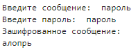
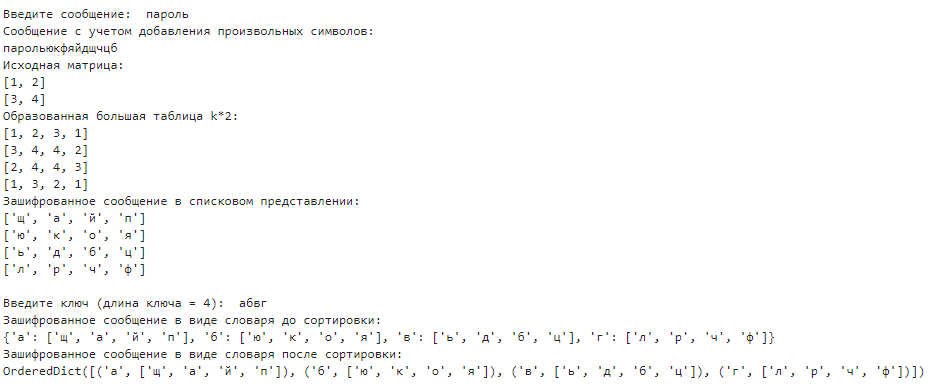
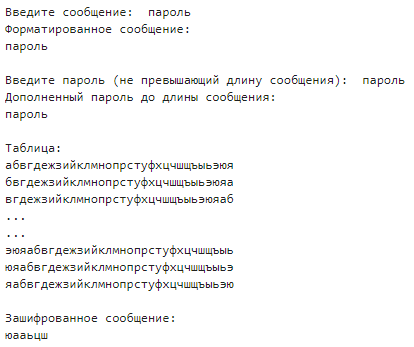

---
## Front matter
lang: ru-RU
title: Лабораторная работа №2
subtitle: Шифры перестановки
author:
  - Баулин Егор Александрович, НФИмд-02-22
institute:
  - Российский университет дружбы народов, Москва, Россия
date: 29 сентября 2022

## i18n babel
babel-lang: russian
babel-otherlangs: english

## Formatting pdf
toc: false
toc-title: Содержание
slide_level: 2
aspectratio: 169
section-titles: true
theme: metropolis
header-includes:
 - \metroset{progressbar=frametitle,sectionpage=progressbar,numbering=fraction}
 - '\makeatletter'
 - '\beamer@ignorenonframefalse'
 - '\makeatother'
---

# Цели и задачи

## Цель лабораторной работы

Знакомство с шифрами перестановки: маршрутным шифрование, шифрованием с помощью решеток, шифрованием при помощи таблицы Виженера.

## Задачи лабораторной работы 

1. Релизовать маршрутное шифрование.
2. Реализовать шифрование с помощью решеток.
3. Реализовать шифрование при помощи таблицы Виженера.

# Выполнение лабораторной работы

## Шифры перестановки

Шифры перестановки преобразуют открытый текст в криптограмму путем перестановки его символов. Способ, каким при шифровании переставляются буквы открытого текста, и является ключом шифра. Важным требованием является равенство длин ключа и исходного текста.

## Маршрутное шифрование

Широкое распространение получили так называемые маршрутные перестановки, использующие некоторую геометрическую фигуру (плоскую или объемную). Преобразования состоят в том, что отрезок открытого текста записывается в такую фигуру по некоторой траектории, а выписывается по другой траектории. 

## Шифрование с помощью решеток

Данный способ шифрования предложил австрийский крипатограф Эдуард Флейснер в 1881 году. Суть этого способа заключается в следующем. Выбирается натуральное число $k>1$, строится квадрат размерности $k$ и построчно заполняется числами $1,2, ... , k^2$.

## Таблица Виженера

Шифр Виженера — метод полиалфавитного шифрования буквенного текста с использованием ключевого слова.

Этот метод является простой формой многоалфавитной замены. Шифр Виженера изобретался многократно. 

# Полученные результаты

## Маршрутное шифрование

{ #fig:001 width=40% }

## Шифрование решетками

{ #fig:002 width=80% }

## Шифрование шифром Виженера

{ #fig:003 width=50% }

# Выводы

## Результаты выполнения лабораторной работы

Таким образом в процессе лабораторной работы были  изучены реализованы следующие методы шифрования: 

 - Маршрутное шифрование.
 - Шифрование с помощью решеток.
 - Шифрование при помощи таблицы Виженера.

