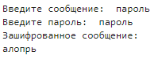
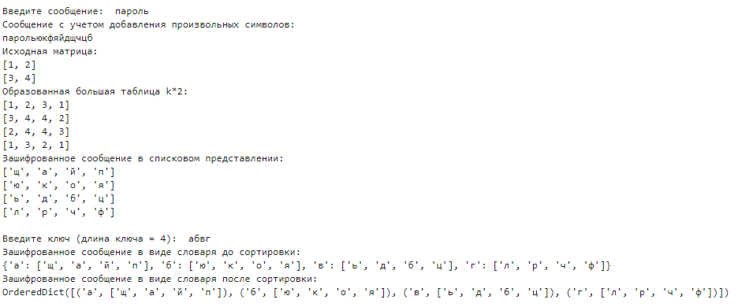
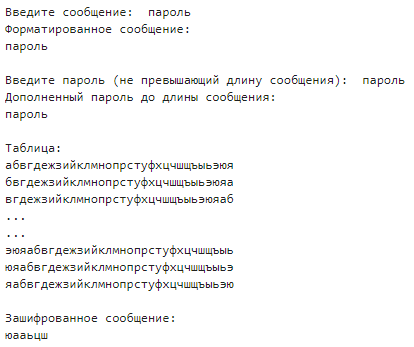

---
## Front matter
title: "Лабораторная работа №2"
subtitle: "Шифры перестановки"
author: "Баулин Егор Александрович, НФИмд-02-22"

## Generic otions
lang: ru-RU
toc-title: "Содержание"

## Bibliography
bibliography: bib/cite.bib
csl: pandoc/csl/gost-r-7-0-5-2008-numeric.csl

## Pdf output format
toc: true # Table of contents
toc-depth: 2
lof: true # List of figures
lot: true # List of tables
fontsize: 12pt
linestretch: 1.5
papersize: a4
documentclass: scrreprt
## I18n polyglossia
polyglossia-lang:
  name: russian
  options:
	- spelling=modern
	- babelshorthands=true
polyglossia-otherlangs:
  name: english
## I18n babel
babel-lang: russian
babel-otherlangs: english
## Fonts
mainfont: PT Serif
romanfont: PT Serif
sansfont: PT Sans
monofont: PT Mono
mainfontoptions: Ligatures=TeX
romanfontoptions: Ligatures=TeX
sansfontoptions: Ligatures=TeX,Scale=MatchLowercase
monofontoptions: Scale=MatchLowercase,Scale=0.9
## Biblatex
biblatex: true
biblio-style: "gost-numeric"
biblatexoptions:
  - parentracker=true
  - backend=biber
  - hyperref=auto
  - language=auto
  - autolang=other*
  - citestyle=gost-numeric
## Pandoc-crossref LaTeX customization
figureTitle: "Рис."
tableTitle: "Таблица"
listingTitle: "Листинг"
lofTitle: "Список иллюстраций"
lotTitle: "Список таблиц"
lolTitle: "Листинги"
## Misc options
indent: true
header-includes:
  - \usepackage{indentfirst}
  - \usepackage{float} # keep figures where there are in the text
  - \floatplacement{figure}{H} # keep figures where there are in the text
---

# Цель работы

Знакомство с шифрами перестановки: маршрутным шифрование, шифрованием с помощью решеток, шифрованием при помощи таблицы Виженера.

# Задание

1. Релизовать маршрутное шифрование.
2. Реализовать шифрование с помощью решеток.
3. Реализовать шифрование при помощи таблицы Виженера.

# Теоретическое введение

Шифры перестановки преобразуют открытый текст в криптограмму путем перестановки его символов. Способ, каким при шифровании переставляются буквы открытого текста, и является ключом шифра. Важным требованием является равенство длин ключа и исходного текста [@shifr]. В классической криптографии шифры перестановки можно разделить на два класса:

- Шифры одинарной (простой) перестановки — при шифровании символы открытого текста перемещаются с исходных позиций в новые один раз.
- Шифры множественной (сложной) перестановки — при шифровании символы открытого текста перемещаются с исходных позиций в новые несколько раз.

## Маршрутное шифрование

Широкое распространение получили так называемые маршрутные перестановки, использующие некоторую геометрическую фигуру (плоскую или объемную). Преобразования состоят в том, что отрезок открытого текста записывается в такую фигуру по некоторой траектории, а выписывается по другой траектории. 

Например, для шифрования текста *нельзя недооценивать противника*, разобьем его на блоки $n=6$. Блоков получится $m=5$. К последнему блоку припишем букву $a$. В качестве пароля выберем слово *пароль*. Теперь выпишем буквы по столбцам в соответствии с алфавитным порядком букв пароля и получим следующую криптограмму: *ЕЕНПНЗОАТАЬОВОКННЕЬВЯЦТИА*.


## Шифрование с помощью решеток

Данный способ шифрования предложил австрийский крипатограф Эдуард Флейснер в 1881 году. Суть этого способа заключается в следующем. Выбирается натуральное число $k>1$, строится квадрат размерности $k$ и построчно заполняется числами $1,2, ... , k^2$. В качестве примера рассмотрим квадрат размерности $k=2$.

Повернем его по часовой стрелке на 90 градусов и присоединим к исходному квадрату справа.

Проделаем еще дважды такую процедуру и получим квадрат размерности $2k$.

Далее из большого квадрата вырезаются клетки с числами от $1$ до $k^2$, для каждого числа одна клетка. Процесс шифрования происходит следующим образом. Сделанная решетка (квадрат с прорезями) накладывается на чистый квадрат $2k /times 2k$ и в прорези по строчкам (т.е. слева направо и сверху вниз) вписываются первые буквы открытого текста. Затем решетка поворачивается на девяносто градусов по часовой стрелке и накладывается на частично заполненный квадрат, вписывание продолжается. После третьего поворота, наложения и вписывания все клетки квадрата будут заполнены. Правило выбора прорезей гарантирует, что при заполнении квадрата буква на букву никогда не попадет. Из заполненного квадрата буквы можно выписать по столбцам, выбрав подходящий пароль [@reshetka]. 

## Таблица Виженера

Шифр Виженера — метод полиалфавитного шифрования буквенного текста с использованием ключевого слова.

Этот метод является простой формой многоалфавитной замены. Шифр Виженера изобретался многократно. Впервые этот метод описал Джовани Баттиста Белласо в книге *La cifra del. Sig. Giovan Battista Bellasо* в 1553 году, однако в XIX веке получил имя Блеза Виженера, французского дипломата. Метод прост для понимания и реализации, но является недоступным для простых методов криптоанализа [@vijen].

# Выполнение лабораторной работы

## Структура программной реализации

### Маршрутное шифрование

Для реализации данного шифрования были описаны 4 метода: `get_nm(message, password)` для расчета размеров `n` и `m` матрицы, `message_to_dict(message, m, n)` для записи сообщения в таблицу, представленную python словарем с ключами букв пароля, `sort_dict(dict)` для сортировки словаря по ключу и метод преобразования словаря в зашифрованное собщение `dict_to_string(dict)`.

### Шифрование с помощью решеток
Для реализации данного шифрования были описаны пять новых методов: `count_k(message)` для расчета размерности матрицы `k`, `init_list(k)` для создания первичной таблицы размерности `k`, `rotate_list(list)` для поворота таблицы, `init_big_table(list)` для инициализации большой таблицы и метод освобождения и заполнения свободных ячеек буквами сообщения `open_spaces(list, message)`.

### Шифрование с помощью таблицы Виженера

Для реализации данного шифрования были описаны три метода: `create_table(alphabet)` для создания таблицы виженера, `make_password(message, password)` для формирования пароля длиной равной длине сообщения и `shifr(message, password, table)` для шифрования сообщения.

## Листинг 

### Реализация маршрутного шифрования.

```
from _collections import OrderedDict

def get_nm(message, password):
    n = len(password)
    result = len(message) / len(password)
    while True:
        if int(result) != result:
            message += 'a'
            result = len(message) / len(password)
        else:
            break
    m = int(result)
    return n, m, message


def message_to_dict(message, m, n):
    message_dict = {}
    for i in range(n):
        temp_message = []
        for j in range(m):
            temp_message.append(message[i + j * n])
        message_dict[password[i]] = temp_message
    return message_dict


def sort_dict(dict):
    return OrderedDict(sorted(dict.items()))


def dict_to_string(dict):
    new_message = ''
    for keys in dict:
        for key in keys:
            new_message += "".join(dict[key])
    return new_message


message = input("Введите сообщение: ").replace(" ", "")
password = input("Введите пароль: ")
n, m, message = get_nm(message, password)
dict_message = message_to_dict(message, m, n)
ordered_dict_message = sort_dict(dict_message)
print("Зашифрованное сообщение: ")
print(dict_to_string(ordered_dict_message))
```

### Реализация шифрования при помощи решеток.

```
from _collections import OrderedDict
import math
import random

def count_k(message):
    k = int(math.ceil((math.sqrt(len(message)) / 2)))
    while True:
        if len(message) == ((2 * k)**2):
            break
        else:
            message += random.choice('йцукенгшщзхъфывапролджэячсмитьбю')
    return k, message

def init_list(k):
    list_to_init = []
    counter = 0
    for i in range(k):
        temp_list = []
        for j in range(k):
            counter += 1
            temp_list.append(counter)
        list_to_init.append(temp_list)
    return list_to_init

def rotate_list(list):
    new_list = []
    for i, row in enumerate(list):
        temp_row_list = []
        for j, col in enumerate(row):
            temp_row_list.append(list[len(list) - j - 1][i])
        new_list.append(temp_row_list)
    return new_list

def init_big_table(list):
    not_rotated_list = list
    result_list = []
    rotated_list1 = rotate_list(not_rotated_list)
    rotated_list2 = rotate_list(rotated_list1)
    rotated_list3 = rotate_list(rotated_list2)
    for ix, item in enumerate(rotated_list1):
        temp_row = not_rotated_list[ix] + rotated_list1[ix]
        result_list.append(temp_row)
    for ix, item in enumerate(rotated_list2):
        temp_row = rotated_list3[ix] + rotated_list2[ix]
        result_list.append(temp_row)
    return result_list

def open_spaces(list, message):
    message_letters_left = message
    spaces = k**2
    i = 1
    while True:
        if i == spaces + 1:
            break
        rand_index_i = random.randint(0, (k * 2) - 1)
        rand_index_j = random.randint(0, (k * 2) - 1)
        if list[rand_index_i][rand_index_j] == i:
            list[rand_index_i][rand_index_j] = message_letters_left[0]
            message_letters_left = message_letters_left[1:]
            i += 1
    return message_letters_left
    
def sorted_to_string(res, password):
    res_dict = dict(zip(password, res))
    print("Зашифрованное сообщение в виде словаря до сортировки: ")
    print(res_dict)
    sorted_dict = sort_dict(res_dict)
    print("Зашифрованное сообщение в виде словаря после сортировки: ")
    print(sorted_dict)
    string_message = dict_to_string(sorted_dict)
    return string_message
    
def sort_dict(dict):
    return OrderedDict(sorted(dict.items()))


def dict_to_string(dict):
    new_message = ''
    for keys in dict:
        for key in keys:
            new_message += "".join(dict[key])
    return new_message


message = input("Введите сообщение: ").replace(' ', '')

k, message = count_k(message)

print("Сообщение с учетом добавления произвольных символов: ")
print(message)

inited = init_list(k)

print("Исходная матрица: ")
print(*inited, sep="\n")

res = init_big_table(inited)
print("Образованная большая таблица k*2: ")
print(*res, sep="\n")
sliced_message = open_spaces(res, message)

res = rotate_list(res)
sliced_message = open_spaces(res, sliced_message)

res = rotate_list(res)
sliced_message = open_spaces(res, sliced_message)

res = rotate_list(res)
sliced_message = open_spaces(res, sliced_message)
print("Зашифрованное сообщение в списковом представлении: ")
print(*res, sep="\n", end="\n\n")

password = input("Введите ключ (длина ключа = {}): ".format(len(res)))
result = sorted_to_string(res, password)
print("\n\nЗашифрованное сообщение: ")
print(result)
```

### Реализация шифра Виженера.

```
def make_password(message, password):
    new_password = ''
    for ix, item in enumerate(message):
        new_password += password[ix % len(password)]
    print(new_password)
    return new_password

alphabet = 'абвгдежзийклмнопрстуфхцчшщъыьэюя'

def create_table(alphabet):
    alphabet_list = []
    current_row = alphabet
    alphabet_list.append(current_row)
    for item in alphabet:
        current_row = current_row[1:] + current_row[0]
        alphabet_list.append(current_row)
    alphabet_list.pop()
    return alphabet_list
    
def visioner(message, password, table):
    indexes_i = []
    res_string = ''
    for ix, letter in enumerate(message):
        index_i = table[0].find(letter)
        indexes_i.append(index_i)
    indexes_j = []
    for ix, letter in enumerate(password):
        index_j = table[0].find(letter)
        indexes_j.append(index_j)
    for i, row in enumerate(indexes_i):
        res_string += table[indexes_i[i]][indexes_j[i]]
    return res_string
    

message = input("Введите сообщение: ").replace(' ', '')
print("Форматированное сообщение: ")
print(message)
print()
password = input("Введите пароль (не превышающий длину сообщения): ")
print("Дополненный пароль до длины сообщения: ")
password = make_password(message, password)
table = create_table(alphabet)
print("\nТаблица: ")
print(*table[0:3], sep='\n')
print("...")
print("...")
print(*table[-3:], sep='\n')
result = shifr(message, password, table)
print("\nЗашифрованное сообщение: ")
print(result)
    
```

## Полученные результаты

Результаты работы программы, реализующей маршрутное шифрование показаны на рис. [-@fig:001].

{ #fig:001 width=40% }

Результаты работы программы, реализующей шифрование при помощи решеток показаны на рис. [-@fig:002].

{ #fig:002 width=80% }

Результаты работы программы, реализующей шифрование методом Виженера показаны на рис. [-@fig:003].

{ #fig:003 width=70% }

Для выхода из программы нужно ввести "0".

# Выводы

Таким образом в процессе лабораторной работы были  изучены реализованы следующие методы шифрования: 

 - Маршрутное шифрование.
 - Шифрование с помощью решеток.
 - Шифрование при помощи таблицы Виженера.

# Список литературы{.unnumbered}

::: {#refs}
:::
