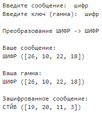

---
## Front matter
lang: ru-RU
title: Лабораторная работа №3
subtitle: Шифрование гаммированием
author:
  - Баулин Егор Александрович, НФИмд-02-22
institute:
  - Российский университет дружбы народов, Москва, Россия
date: 14 октября 2022

## i18n babel
babel-lang: russian
babel-otherlangs: english

## Formatting pdf
toc: false
toc-title: Содержание
slide_level: 2
aspectratio: 169
section-titles: true
theme: metropolis
header-includes:
 - \metroset{progressbar=frametitle,sectionpage=progressbar,numbering=fraction}
 - '\makeatletter'
 - '\beamer@ignorenonframefalse'
 - '\makeatother'
---

# Цели и задачи

## Цель лабораторной работы

Знакомство с шифрованием гаммированием на примере гаммирования конечной гаммой.

## Задачи лабораторной работы 

Реализовать алгоритм шифрования гаммированием конечной гаммой.

# Выполнение лабораторной работы

## Теоретическое введение

Гаммирование, или Шифр XOR, — метод симметричного шифрования, заключающийся в «наложении» последовательности, состоящей из случайных чисел, на открытый текст. Последовательность случайных чисел называется гамма-последовательностью и используется для зашифровывания и расшифровывания данных. Суммирование обычно выполняется в каком-либо конечном поле.

## Теоретическое введение

{ #fig:01 width=70% }

# Полученные результаты

## Шифрование гаммированием

{ #fig:02 width=70% }

# Выводы

## Результаты выполнения лабораторной работы

Таким образом в процессе лабораторной работы изучено и реализовано шифрование гаммирования конечной гаммой.

