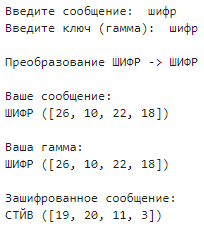

---
## Front matter
title: "Лабораторная работа №3"
subtitle: "Шифрование гаммированием"
author: "Баулин Егор Александрович, НФИмд-02-22"

## Generic otions
lang: ru-RU
toc-title: "Содержание"

## Bibliography
bibliography: bib/cite.bib
csl: pandoc/csl/gost-r-7-0-5-2008-numeric.csl

## Pdf output format
toc: true # Table of contents
toc-depth: 2
lof: true # List of figures
lot: true # List of tables
fontsize: 12pt
linestretch: 1.5
papersize: a4
documentclass: scrreprt
## I18n polyglossia
polyglossia-lang:
  name: russian
  options:
	- spelling=modern
	- babelshorthands=true
polyglossia-otherlangs:
  name: english
## I18n babel
babel-lang: russian
babel-otherlangs: english
## Fonts
mainfont: PT Serif
romanfont: PT Serif
sansfont: PT Sans
monofont: PT Mono
mainfontoptions: Ligatures=TeX
romanfontoptions: Ligatures=TeX
sansfontoptions: Ligatures=TeX,Scale=MatchLowercase
monofontoptions: Scale=MatchLowercase,Scale=0.9
## Biblatex
biblatex: true
biblio-style: "gost-numeric"
biblatexoptions:
  - parentracker=true
  - backend=biber
  - hyperref=auto
  - language=auto
  - autolang=other*
  - citestyle=gost-numeric
## Pandoc-crossref LaTeX customization
figureTitle: "Рис."
tableTitle: "Таблица"
listingTitle: "Листинг"
lofTitle: "Список иллюстраций"
lotTitle: "Список таблиц"
lolTitle: "Листинги"
## Misc options
indent: true
header-includes:
  - \usepackage{indentfirst}
  - \usepackage{float} # keep figures where there are in the text
  - \floatplacement{figure}{H} # keep figures where there are in the text
---

# Цель работы

Знакомство с шифрованием гаммированием на примере гаммирования конечной гаммой.

# Задание

Реализовать алгоритм шифрования гаммированием конечной гаммой.

# Теоретическое введение

Гаммирование, или Шифр XOR, — метод симметричного шифрования, заключающийся в «наложении» последовательности, состоящей из случайных чисел, на открытый текст. Последовательность случайных чисел называется гамма-последовательностью и используется для зашифровывания и расшифровывания данных. Суммирование обычно выполняется в каком-либо конечном поле.

При шифровании гаммированием формируется `m` - разрядная случайная последовательность. Пусть `k` -  передаваемое сообщение
$$ k=k_{1}k_{2}...k_{i}...k_{m}, $$  
а `p` - последовательность, которая является ключом:
$$ p=p_{1}p_{2}...p_{i}...p_{m}, $$  
тогда `i`-ый символ криптограммы будет равен:
$$ c_{i} = p_{i} \oplus k_{i}, $$  
где $\oplus$ - операция побитового сложения XOR [@xor]. В результате криптограмму можно записать следующим образом:
$$ c=c_{1}c_{2}...c_{i}...c_{m} $$  

Более подробно о шифровании гаммированием: [@gammirovanie]

# Выполнение лабораторной работы

## Описание реализации метода шифрования

В данной работе применяется схема однократного использования (рис. [-@fig:01]). К элементам ключа и исходного сообщения применяется побитовое сложение XOR, в результате чего формируется зашифрованное сообщение:  

{ #fig:01 width=70% }

Для того, чтобы применить операцию побитового сложения, необходимо, чтобы ключ и исходное сообщение были одной длины. Для достижения данной цели, ключ растягивается до тех пор, пока не сравняется длиной с исходным сообщением следующим образом: пусть сообщение будет 
$$ SECURITY, $$  
длина 'm' которого равна 12, тогда ключ растягивается следующим образом:
$$ KEY \rightarrow KEYKEYKE $$
Таким образом, к сообщению и ключу одинаковой длины можно применить операцию побитового сложения XOR.


## Листинг

```
alphabet = "абвгдеёжзийклмнопрстуфхцчшщъыьэюя"
ignore_symbols = "!.,@#$%^&*()-+={}[]<>/ "

def gamma_shifr(gamma, message_length):
    new = ""
    for i in range(message_length):
        new += gamma[i % len(gamma)]
    return new

def get_indexes(text):
    indexes = []
    for letter in text:
        try:
            indexes.append(alphabet.index(letter) + 1)
        except ValueError:
            indexes.append(ignore_symbols.index(letter) + 10000)
    return indexes

def encrypt(message_indexes, gamma_indexes):
    indexes = []
    for ix, item in enumerate(message_indexes):
        if message_indexes[ix] > 10000 or gamma_indexes[ix] > 10000:
            result = item
            indexes.append(result)
            continue
        result = (message_indexes[ix] + gamma_indexes[ix]) % len(alphabet)
        indexes.append(result)
    return indexes

def to_text(indexes):
    text = ""
    for index in indexes:
        if index > 10000:
            text += ignore_symbols[index - 10000]
            continue
        text += alphabet[index - 1]
    return text

message = input("Введите сообщение: ")
gamma = input("Введите ключ (гамма): ")
new = gamma_shifr(gamma, len(message))
print("\nПреобразование {} -> {}".format(gamma.upper(), new.upper()))
message_indexes = get_indexes(message)
print("\nВаше сообщение:\n{} ({})".format(message.upper(), message_indexes))
gamma_indexes = get_indexes(new)
print("\nВаша гамма:\n{} ({})".format(gamma.upper(), gamma_indexes))
encrypted_message_indexes = encrypt(message_indexes, gamma_indexes)
encrypted_message = to_text(encrypted_message_indexes)
print("\nЗашифрованное сообщение:\n{} ({})"
	.format(encrypted_message.upper(), encrypted_message_indexes))
```

## Полученные результаты

При запуске программы пользователю предлагается ввести сообщение, которое необходимо зашифровать, и ключ. После этого, если ключ и сообщения разной длины, из ключа исключаются лишние символы или добавляются в конец новые. Знаки препинания и пробелы, в свою очередь, игнорируются и остаются в неизменном виде. Для удобства, они нумеруются начиная с индекса 10000. В результате выполнения пользователь получает зашифрованное сообщение (рис. [-@fig:02]).  

{ #fig:02 width=70% }

# Выводы

Таким образом в процессе лабораторной работы изучено и реализовано шифрование гаммирования конечной гаммой.

# Список литературы{.unnumbered}

::: {#refs}
:::
