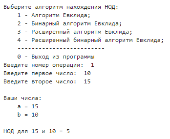
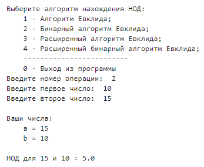
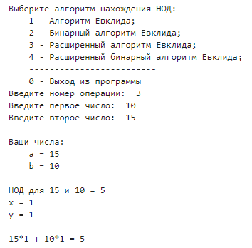
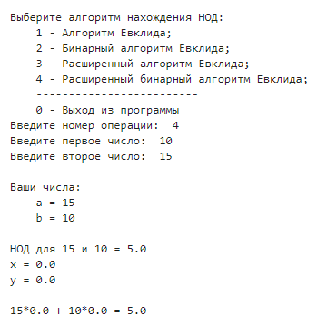

---
## Front matter
lang: ru-RU
title: Лабораторная работа №4
subtitle: Вычисление наибольшего общего делителя
author:
  - Баулин Егор Александрович, НФИмд-02-22
institute:
  - Российский университет дружбы народов, Москва, Россия
date: 29 октября 2022

## Formatting
mainfont: PT Serif
romanfont: PT Serif
sansfont: PT Sans
monofont: PT Mono
toc: false
slide_level: 2
theme: metropolis
header-includes: 
 - \metroset{progressbar=frametitle,sectionpage=progressbar,numbering=fraction}
 - '\makeatletter'
 - '\beamer@ignorenonframefalse'
 - '\makeatother'
aspectratio: 43
section-titles: true

---

# Цели и задачи

## Цель лабораторной работы

Ознакомиться с алгоритмами вычисления наибольшего общего делителя.

## Задачи лабораторной работы 

Реализовать четыре алгоритма вычисления НОД:  
1. Алгоритм Евклида;  
2. Бинарный алгоритм Евклида;  
3. Расширенный алгоритм Евклида;  
4. Расширенный бинарный алгоритм Евклида.

# Выполнение лабораторной работы

## Наибольший общий делитель

Наибольшим общим делителем (НОД) для двух целых чисел `a` и `b` называется наибольший из их общих делителей. Наибольший общий делитель существует и однозначно определён, если хотя бы одно из чисел `a` или `b` не равно нулю.

## Алгоритм Евклида

Для вычисления наибольшего общего делителя двух целых чисел применяется способ повторного деления с остатком, называемый алгоритмом Евклида.

## Бинарный алгоритм Евклида

Бинарный алгоритм Евклида является более быстрым при реализации на компьютере, поскольку использует двоичное представление чисел `a` и `b`.

## Расширенный алгоритм Евклида

Расширенный алгоритм Евклида находит наибольший общий делитель `d` чисел `а` и `b` и его линейное представление, т. е. целые числа `x` и `у`, для которых $ax + by = d$.

## Расширенный бинарный алгоритм Евклида

Расширенный бинарный алгоритм Евклида так же, как и предыдущий алгоритм, позволяет найти наибольший общий делитель `d` чисел `а` и `b` и его линейное представление, но при том используется двоичное представление чисел `a` и `b`.

## Описание реализации алгоритмов

В данной работе были описаны 4 метода для нахождения наибольшего общего делителя. Каждый из методов принимает на вход два целых положительных числа `a` и `b`, причем `a` не должно быть меньше `b`. В результате отработки каждый из методов возвращает наибольший общий делитель этих двух целых чисел, а расширенные версии этих методов дополнительно возвращают `x` и `y` коэффициенты такие, что выполняется следующее равенство:
$$ ax + by = d, $$
где `d` - наибольший общий делитель чисел `a` и `b`.

# Полученные результаты

## Алгоритм Евклида

{ #fig:1 width=70% }  

## Бинарный алгоритм Евклида

{ #fig:2 width=70% }  

## Расширенный алгоритм Евклида

{ #fig:3 width=55% }  

## Расширенный бинарный алгоритм Евклида

{ #fig:4 width=55% }  

# Выводы

## Результаты выполнения лабораторной работы

В ходе выполнения данной лабораторной работы было выполнено ознакомление с различными методами нахождения наибольшего общего делителя.  
В результате проделанной работы были программно реализованы следующие методы нахождения НОД: алгоритм Евклида, бинарный алгоритм Евклида, расширенный алгоритм Евклида и расширенный бинарный алгоритм Евклида.