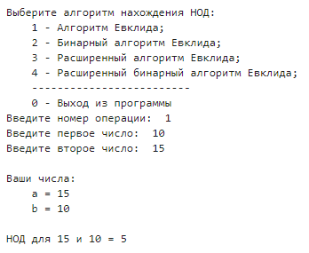
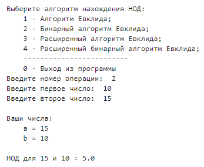
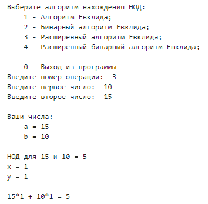
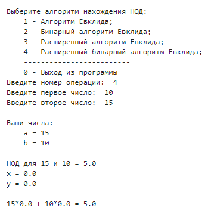

---
## Front matter
title: "Лабораторная работа №4"
subtitle: "Вычисление наибольшего общего делителя"
author: "Баулин Егор Александрович, НФИмд-02-22"

## Generic otions
lang: ru-RU
toc-title: "Содержание"

## Bibliography
bibliography: bib/cite.bib
csl: pandoc/csl/gost-r-7-0-5-2008-numeric.csl

## Pdf output format
toc: true # Table of contents
toc-depth: 2
lof: true # List of figures
lot: true # List of tables
fontsize: 12pt
linestretch: 1.5
papersize: a4
documentclass: scrreprt
## I18n polyglossia
polyglossia-lang:
  name: russian
  options:
	- spelling=modern
	- babelshorthands=true
polyglossia-otherlangs:
  name: english
## I18n babel
babel-lang: russian
babel-otherlangs: english
## Fonts
mainfont: PT Serif
romanfont: PT Serif
sansfont: PT Sans
monofont: PT Mono
mainfontoptions: Ligatures=TeX
romanfontoptions: Ligatures=TeX
sansfontoptions: Ligatures=TeX,Scale=MatchLowercase
monofontoptions: Scale=MatchLowercase,Scale=0.9
## Biblatex
biblatex: true
biblio-style: "gost-numeric"
biblatexoptions:
  - parentracker=true
  - backend=biber
  - hyperref=auto
  - language=auto
  - autolang=other*
  - citestyle=gost-numeric
## Pandoc-crossref LaTeX customization
figureTitle: "Рис."
tableTitle: "Таблица"
listingTitle: "Листинг"
lofTitle: "Список иллюстраций"
lotTitle: "Список таблиц"
lolTitle: "Листинги"
## Misc options
indent: true
header-includes:
  - \usepackage{indentfirst}
  - \usepackage{float} # keep figures where there are in the text
  - \floatplacement{figure}{H} # keep figures where there are in the text
---

# Цель работы

Ознакомиться с алгоритмами вычисления наибольшего общего делителя.

# Задание

Реализовать четыре алгоритма вычисления НОД:  
1. Алгоритм Евклида;  
2. Бинарный алгоритм Евклида;  
3. Расширенный алгоритм Евклида;  
4. Расширенный бинарный алгоритм Евклида.

# Теоретическое введение

Наибольшим общим делителем (НОД) для двух целых чисел `a` и `b` называется наибольший из их общих делителей. Наибольший общий делитель существует и однозначно определён, если хотя бы одно из чисел `a` или `b` не равно нулю.

## Алгоритм Евклида

Для вычисления наибольшего общего делителя двух целых чисел применяется способ повторного деления с остатком, называемый алгоритмом Евклида [@1].

## Бинарный алгоритм Евклида

Бинарный алгоритм Евклида является более быстрым при реализации на компьютере, поскольку использует двоичное представление чисел `a` и `b` [@2].

## Расширенный алгоритм Евклида

Расширенный алгоритм Евклида находит наибольший общий делитель `d` чисел `а` и `b` и его линейное представление, т. е. целые числа `x` и `у`, для которых $ax + by = d$ [@3].

## Расширенный бинарный алгоритм Евклида

Расширенный бинарный алгоритм Евклида так же, как и предыдущий алгоритм, позволяет найти наибольший общий делитель `d` чисел `а` и `b` и его линейное представление, но при том используется двоичное представление чисел `a` и `b` [@4].

# Выполнение лабораторной работы

В рамках данной лабораторной работы были программно описаны 4 алгоритма нахождения наибольшего общего делителя.  

## Описание реализации алгоритмов

В данной работе были описаны 4 метода для нахождения наибольшего общего делителя. Каждый из методов принимает на вход два целых положительных числа `a` и `b`, причем `a` не должно быть меньше `b`. В результате отработки каждый из методов возвращает наибольший общий делитель этих двух целых чисел, а расширенные версии этих методов дополнительно возвращают `x` и `y` коэффициенты такие, что выполняется следующее равенство:
$$ ax + by = d, $$
где `d` - наибольший общий делитель чисел `a` и `b`.


## Листинг

Код приведенной ниже программы реализован на языке python.

```
def euclid(a, b):
    r = []
    r.append(a)
    r.append(b)
    i = 1
    while True:
        r.append(r[i - 1] % r[i])
        if r[i + 1] == 0:
            d = r[i]
            return d
        else:
            i = i + 1


def binary_euclid(a, b):
    g = 1
    while a % 2 == 0 and b % 2 == 0:
        a = a / 2
        b = b / 2
        g = 2 * g
    u = a
    v = b
    while u != 0:
        while u % 2 == 0:
            u = u / 2
        while v % 2 == 0:
            v = v / 2
        if u >= v:
            u = u - v
        else:
            v = v - u
    d = g * v
    return d


def extended_euclid(a, b):
    r = []
    x = []
    y = []

    r.append(a)
    r.append(b)

    x.append(1)
    x.append(0)

    y.append(0)
    y.append(1)

    while r[1] != 0:
        q = r[0] // r[1]
        r[0], r[1] = r[1], r[0] - (r[1] * q)
        x[0], x[1] = x[1], x[0] - (x[1] * q)
        y[0], y[1] = y[1], y[0] - (y[1] * q)

    d, x, y = r[0], x[0], y[0]

    return d, x, y


def binary_extended_euclid(a, b):
    g = 1

    while a % 2 == 0 and b % 2 == 0:
        a = a / 2
        b = b / 2
        g = 2 * g

    u = a
    v = b

    A = 1
    B = 0
    C = 0
    D = 1

    while u != 0:

        while u % 2 == 0:

            u = u / 2

            if A % 2 == 0 and B % 2 == 0:
                A = A / 2
                B = B / 2
            else:
                A = (A + B) / 2
                B = (B - A) / 2

        while v % 2 == 0:
            v = v / 2

            if C % 2 == 0 and D % 2 == 0:
                C = C / 2
                D = D / 2
            else:
                C = (C + B) / 2
                D = (D - A) / 2

        if u >= v:
            u = u - v
            A = A - C
            B = B - D
        else:
            v = v - u
            C = C - A
            D = D - B

    d = g * v
    x = C
    y = D

    return d, x, y


if __name__ == '__main__':
    while True:
        try:
            result_code = int(input(
                """
Выберите алгоритм нахождения НОД:
    1 - Алгоритм Евклида;
    2 - Бинарный алгоритм Евклида;
    3 - Расширенный алгоритм Евклида;
    4 - Расширенный бинарный алгоритм Евклида;
    -------------------------
    0 - Выход из программы
Введите номер операции: """
            ))
            if result_code > 4:
                print("Ошибка ввода!")
                continue
            if result_code == 0:
                break
        except:
            print("Ошибка ввода!")
            continue

        first = int(input("Введите первое число: "))
        second = int(input("Введите второе число: "))
        if first < second:
            first, second = second, first
        print(
            """
Ваши числа:
    a = {}
    b = {}
""".format(first, second))

        if result_code == 1:
            gcd = euclid(first, second)
            print("НОД для {} и {} = {}".format(first, second, gcd))

        if result_code == 2:
            gcd = binary_euclid(first, second)
            print("НОД для {} и {} = {}".format(first, second, gcd))

        if result_code == 3:
            gcd, x, y = extended_euclid(first, second)
            print("НОД для {} и {} = {}\nx = {}\ny = {}\n\n{}*{} + {}*{} = {}"
                  .format(first, second, gcd, x, y, first, x, second, y, gcd))

        if result_code == 4:
            gcd, x, y = binwary_extended_euclid(first, second)
            print("НОД для {} и {} = {}\nx = {}\ny = {}\n\n{}*{} + {}*{} = {}"
                  .format(first, second, gcd, x, y, first, x, second, y, gcd))

```

## Полученные результаты

При запуске программы пользователю предлагается взаимодействие через диалог с консольным меню. Пользователю в бесконечном цикле предлагается выбрать один из четырех реализованных методов нахождения НОД двух чисел, при этом на вход разрешается вводить только целые неотрицательные числа. На рис. [-@fig:1] представлен алгоритм работы алгоритма Евклида:  

{ #fig:1 width=70% }  

Далее на рис. [-@fig:2] представлена работа бинарного алгоритма Евклида:  

{ #fig:2 width=70% }  

На рис. [-@fig:3] демонстрируется работа расширенного алгоритма Евклида:  

{ #fig:3 width=70% }  

На последнем рис. [-@fig:4] отображено взаимодействие пользователя с расширенным бинарным алгоритмом Евклида:  

{ #fig:4 width=70% }  


# Выводы

В ходе выполнения данной лабораторной работы было выполнено ознакомление с различными методами нахождения наибольшего общего делителя.  
В результате проделанной работы были программно реализованы следующие методы нахождения НОД: алгоритм Евклида, бинарный алгоритм Евклида, расширенный алгоритм Евклида и расширенный бинарный алгоритм Евклида.  
В итоге поставленные цели и задачи были успешно достигнуты.

# Список литературы{.unnumbered}

::: {#refs}
:::
